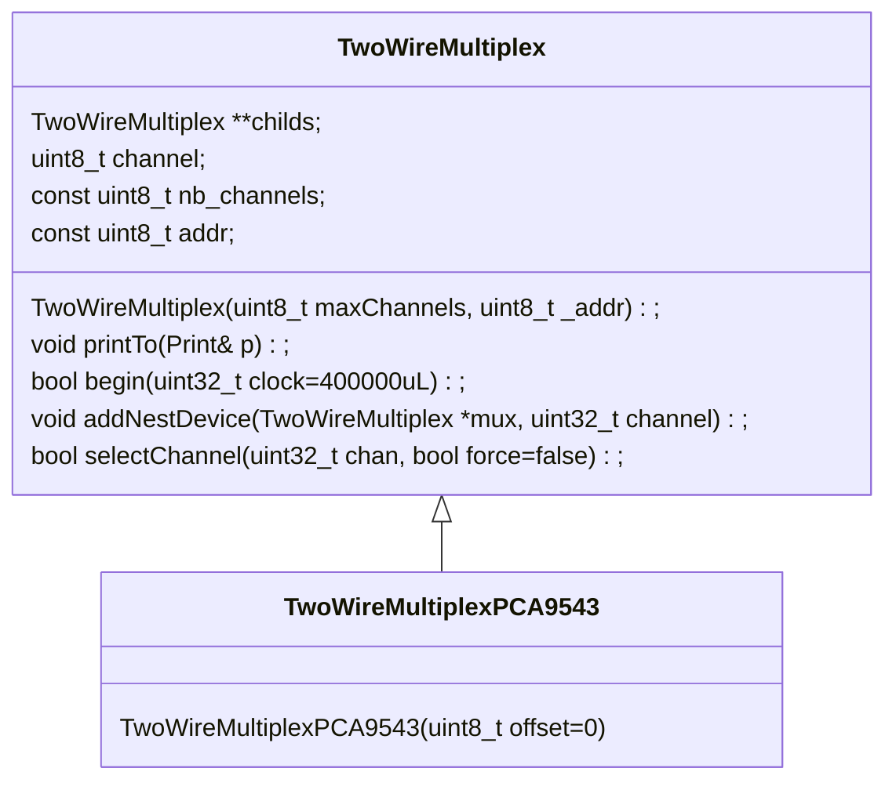

# TwoWireMultiplex
Manage the I2C bus multiplexing through multiplex devices (TCA9543, TCA9448, etc)





The TwoWireMultiplex class allows a daisychain tree, by using addNestDevice method (which populates the childs), up to 4 nesting levels
selectChannel uses an uint32 for 8 (4 bits each) nesting levels

For instance, selectChannel(0xF01274) will select path 4.7.2.1.0
- level0 (root) : use child 4
- level1 : use child 7
- level2 : use child 2
- level3 : use child 1 
- level4 : use child 0
- level5 (last): use none

## Usage
Create an instance of the class TwoWireMultiplex 


```C++
  #include "TwoWireMultiplex.h"
  TwoWireMultiplexPCA9543 busMux; // using a TCA9543 device for multiplexing 2 I2C bus
  TwoWireMultiplexPCA9543 busMuxChild1, busMuxChild2;
  void setup() {

    if (busMux.begin(I2C_BAUDRATE)) {
      // Wire.begin is called by TwoWireMultiplexPCA9543, and clock set to I2C_BAUDRATE
      Serial.println(F("OK"));    
    } else {
      Serial.println(F("FAILED"));
      return;
    }
    busmux.addNestDevice(&busMuxChild1, 0);
    busmux.addNestDevice(&busMuxChild2, 1);
    
    busMux.selectChannel(0, true);  // initialize/configure the device
    Wire.beginTransmission(0x68);     
    ...

    busMux.selectChannel(0x11, true);  // select chan 1 of child2
    Wire.beginTransmission(0x44);     
    ...

    
  }
```


Class built from Mermaid (https://mermaid.js.org/intro/)